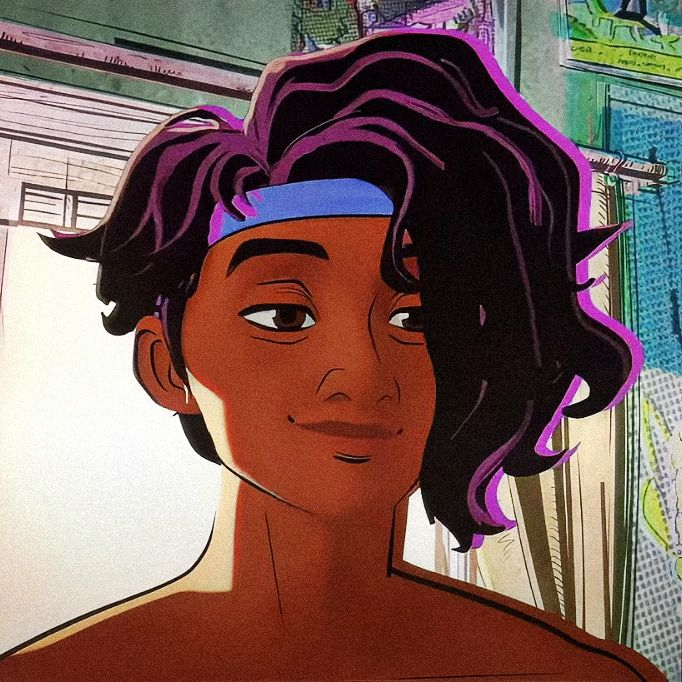

<table>
    <tr>
      <td>
- OOOIIIII! Me chamo Rafael Coura (Couraeel), tenho 20 anos e curso Ciência da Computação, gosto de música, programação e dos meus amigos<3.  
- Estou sempre buscando aprender coisas novas, mas atualmente exploro o desenvolvimento web e de jogos, especialmente utilizando unity e gamemaker.   
- Por aqui compartilho praticamente tudo então não se preocupe se achar algum arquivo chamado "pão com salsicha.py".   
      </td>
      <td align="right" style="min-width: 180px;">
          
      </td>
      </tr>
  </table>

📊 Algumas Metricas

💡 Linguagens e Frameworks
  

🛠️ Outras ferramentas
  

💾 Meus Projetos
  

<!--
        caption -> legenda
        thead -> Table header (cabeçalho da tabela)
        tbody -> Table body (corpo da tabela)
        tfoot -> Table Footer (rodape da tabela)
-->
 
<table border="2">
    <thead>
        <tr>
            <th>Projetos</th>
            <th>Descrição</th>
            <th>Acesso</th>
        </tr>
    </thead>
    <tbody>
        <tr>
            <td>Biblioteca de Alexandria</td>
            <td>Aplicação para gerenciamento acadêmico</td>
            <td><a href="(https://github.com/Devrichas/Biblioteca_de_Alexandria)"target="_self"/>Biblioteca</a></td>
        </tr>
    </tbody>

</table>

🎧 O que estou escutando enquanto programo 🎧

